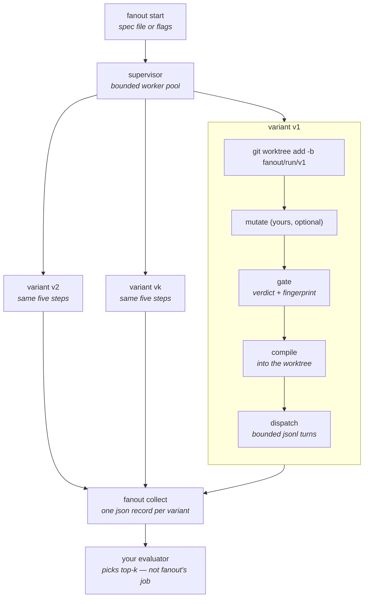

# fanout

Dispatch and supervise `k` isolated tenon agents — one git worktree, one
source fingerprint, one branch each.

fanout is a **separate tool that consumes tenon's CLI**, not a tenon
subcommand. Tenon's [north star](../docs/north-star.md) keeps evaluation,
scoring, selection among revisions, and lineage tracking out of scope, and
[use cases](../docs/use-cases.md#give-an-improvement-loop-a-substrate) says
plainly that *how variants are isolated — worktrees, containers, sandboxes —
is your infrastructure choice*. fanout is one such choice. It adds nothing to
tenon's contract and requires no change to it.

It manages lifecycle. It does not mutate, score, or select: mutation is a
shell command you supply, and selection reads `fanout collect`'s JSON.

## What it does per variant

| Step | Command |
| --- | --- |
| 1. Isolate | `git worktree add -b fanout/<run>/<variant> <dir> <base>` |
| 2. Mutate *(optional)* | your shell command, run in the variant's agent directory |
| 3. Gate and identify | the adapter's `gate` — prove the variant for the harness, mint its fingerprint |
| 4. Compile | the adapter's `compile` — write the harness-native configuration into the worktree |
| 5. Dispatch | the adapter's `dispatch` — run the task as bounded JSONL turns |

Steps 3-5 go through [`tenon.py`](tenon.py), the adapter, which is the only
module here that names a tenon subcommand or flag. The roles are named for
what the caller wants rather than for the subcommand that currently provides
it, so a change to tenon's surface costs one file and the recorded streams
under `testdata/` say whether it still parses.



Every variant carries its own fingerprint, so a downstream evaluator joins
its score to the exact configuration that produced it — the join key tenon
already stamps on every apply record and dispatch event.

## Install

Python **3.11 or newer**, `git`, and a `tenon` binary. Nothing else: the whole
module is standard library, so there is no `pyproject.toml`, no lockfile, and
no virtualenv to create. `evolve` and the judge are run directly.

```bash
ln -s "$PWD/improve/fanout.py" /usr/local/bin/fanout
```

Point it at a tenon with `--tenon PATH` or `FANOUT_TENON`; otherwise it takes
the first `tenon` on `PATH`. Build one with `go build -o ./tenon ./cmd/tenon`.

## Tests

```bash
./scripts/check-improve.sh
```

That compiles every module in `improve/` — the cheap syntax gate over the
files with no tests — and runs the three suites that do have them. All are
stdlib self-runners, needing no network and no tenon binary:

```bash
python3 improve/test_tenon.py       # the adapter, its fixtures, its confinement
python3 improve/test_evolve.py      # the spec validation the search depends on
python3 improve/judge/test_scoring.py
```

## Quick start

Three variants of the same agent, same task, run concurrently:

```bash
fanout start --run try --agent ./agent --harness claude --k 3 --task "Fix the failing test."
```

Then:

```bash
fanout status try
```

```bash
fanout collect try --json
```

`collect` prints one record per variant — status, tenon's `outcome`,
fingerprint, `source_digest`, the error-severity `diagnostics` of whichever
gate rejected it, terminal turn statuses, branch, head SHA, patch path, and
(with `--text`) the agent's reassembled output. That JSON is the handoff to
whatever ranks top-k. fanout computes no score and picks no winner.

A variant that tenon rejected has no fingerprint — tenon mints one only for a
source that passes — so its `source_digest` names the bytes that failed
instead. A variant whose status is `errored` failed for an environmental
reason, not because of anything the variant did: score it and you are scoring
your infrastructure.

## Top-k with different mutations

Give each variant its own mutation. `mutate` runs in the variant's agent
directory with `FANOUT_VARIANT`, `FANOUT_INDEX`, `FANOUT_AGENT_DIR`,
`FANOUT_WORKSPACE`, `FANOUT_VARIANT_DIR`, `FANOUT_RUN`, `FANOUT_HARNESS`, and
`FANOUT_TENON` in the environment — plus anything under the variant's `env`.

```json
{
  "run": "prompt-sweep",
  "agent": "agent",
  "harness": "claude",
  "task": "Fix the failing test in internal/apply.",
  "concurrency": 4,
  "timeout": "900s",
  "variants": [
    { "name": "terse",    "mutate": "printf '\nPrefer the smallest correct diff.\n' >> instructions.md" },
    { "name": "tdd",      "mutate": "cp -R ../../../variants/tdd-skill skills/tdd" },
    { "name": "baseline" },
    { "name": "pin-pinned", "pins": "/abs/path/to/pins.json" }
  ]
}
```

```bash
fanout start --spec prompt-sweep.json
```

Each mutation yields a different source fingerprint, which is exactly what
makes the variants citable experimental units rather than a blur:

```
terse      done    fp=sha256:4f5e2a51e  turns=completed  files=5  fanout/prompt-sweep/terse
tdd        done    fp=sha256:22f2da3a2  turns=completed  files=6  fanout/prompt-sweep/tdd
baseline   done    fp=sha256:a3c02ec18  turns=completed  files=4  fanout/prompt-sweep/baseline
```

Flags override spec fields, so one spec covers a sweep and the command line
covers the axis you are moving today (`--base`, `--harness`, `--pins`).

## Where the agent project lives

- **Relative `--agent` (default `.`)** resolves *inside each worktree*. The
  mutation edits the variant's own copy, and those edits land in the
  variant's branch and patch. This is the shape for an improvement loop
  revising an agent's own files.
- **Absolute `--agent`** is copied into the variant's state directory. The
  source tree is never touched; the worktree carries only the run's effects.

## Lifecycle

```bash
fanout start   [--spec FILE] [flags] [--detach] [--dry-run]
fanout list
fanout status  RUN [--json]
fanout logs    RUN VARIANT [-f] [--text] [--stderr]
fanout stop    RUN
fanout collect RUN [--json] [--text] [--no-commit]
fanout clean   RUN [--force] [--keep-branches] [--keep-state]
```

`start` runs in the foreground with progress on stderr, or `--detach`
backgrounds a supervisor in its own process group; `stop` signals that group,
and every in-flight variant is recorded `cancelled`. One variant's failure is
isolated — the rest keep going, and `start` exits non-zero if any variant did
not finish clean. Pass `--fail-fast` to cancel the others on the first
failure.

`collect` commits each worktree's result to its branch by default (pass
`--no-commit` to leave it dirty), so promoting a winner is
`git checkout fanout/<run>/<variant>`. The patch includes tenon's generated
harness files (`CLAUDE.md`, `.mcp.json`, …) — they are part of what the
variant actually ran.

`clean` removes worktrees, deletes branches, and drops the run's state.

## State layout

Under `$FANOUT_HOME` (default `~/.fanout`), or `--state-dir`:

```
<state>/<run>/
  run.json                     the resolved, immutable spec
  state.json                   live per-variant lifecycle state
  supervisor.pid, supervisor.log
  variants/<name>/
    <run>-<name>/              the git worktree (leaf name unique per variant)
    agent/                     only when --agent was absolute
    mutate.log
    check.jsonl, check.err     the gate's stream, terminator included
    apply.jsonl, apply.err     compile's stream, terminator included
    events.jsonl               dispatch's event stream
    run.err
    diff.patch                 written by collect
```

Nothing is written into the repository being fanned out except the worktrees
and branches, which `clean` removes.

## Bounds

- `--timeout` is the whole-process deadline per variant, capped at **29m30s**
  — tenon's own cap is 30 minutes, and the adapter's clock needs the last 30
  seconds of it. The adapter owns the verdict, so it hands tenon a backstop of
  the budget plus that headroom; a budget at tenon's cap would make both
  clocks fire at once and a slow variant would be reported as an environment
  error instead of the finding it is. The relationship is stated once, in the
  adapter (`MAX_DISPATCH_TIMEOUT_S`), and fanout imports it.
  `--turn-timeout` is optional and per turn.

  **A variant that outruns its budget is a finding about the variant, not an
  infrastructure failure.** The adapter enforces the wall clock itself rather
  than relying on tenon's `--timeout`, whose overrun ends the stream as an
  ordinary environment error, indistinguishable from an unreadable pin set;
  on expiry it terminates the dispatch's whole process group — SIGTERM, then
  SIGKILL after a grace, so the harness and any tool server under it go too —
  and reports `outcome: timed_out` with whatever turns finished first. fanout
  marks the variant `failed` and records that outcome, so a downstream scorer
  penalises a slow agent instead of dropping it. Dropping it is what lets a
  search drift toward whatever fits the budget without ever paying for being
  slow.
- `--task` is one turn; a list of strings in a spec is several turns in one
  conversation, dispatched FIFO with deduplicating input IDs
  (`<run>-<variant>-<n>`).
- Concurrency defaults to `min(k, 4)`. Each variant is a full harness
  process against a full checkout — size it for the machine, not for `k`.
- fanout assumes `--base` exists in the repository and that `k` worktrees of
  it fit on disk.
- fanout is not a sandbox. Each variant is an ordinary checkout running an
  ordinary harness with whatever permissions that harness has.
